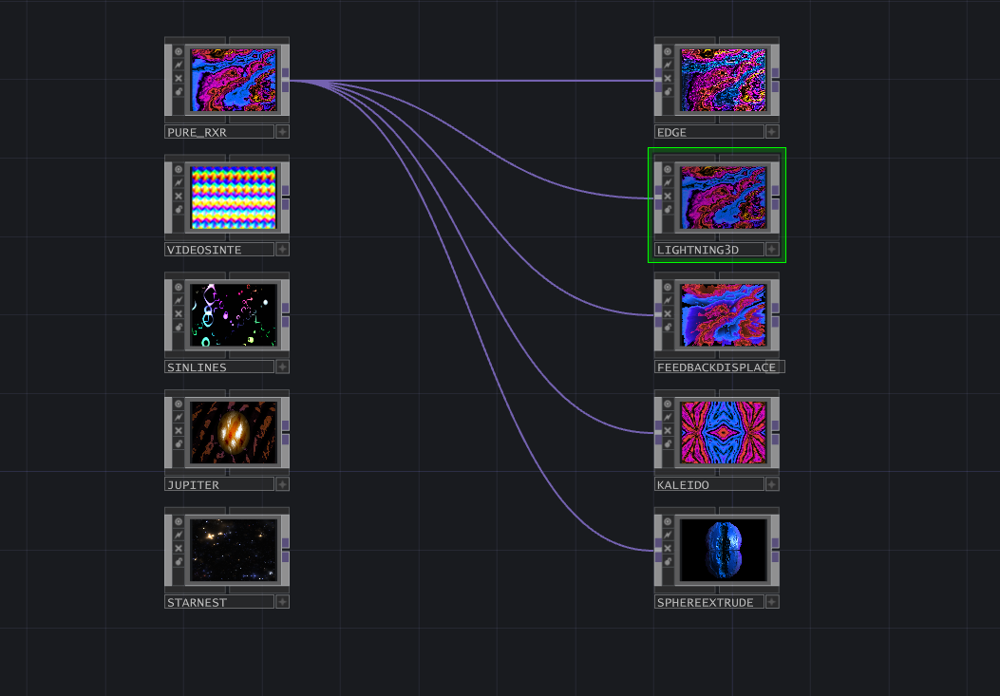

# TouchDesigner Shader Collection

This repository contains a collection of TouchDesigner patches featuring shaders I've frequently used and adapted for TouchDesigner. This collection may grow over time as I add more shaders.

## Shader Categories

The shaders are organized into two categories:

### 1. Generative Visual Shaders
These shaders generate visuals from scratch, creating immersive effects and animations.

- **PURE RXR**
- **VIDEOSINTE**
- **SINLINES**
- **JUPITER**
- **STARNEST**

### 2. Input Manipulation Shaders
These shaders apply various transformations to input visuals, adding unique and captivating effects.

- **EDGE**
- **LIGHTNING3D**
- **FEEDBACKDISPLACE**
- **KALEIDO**
- **SPHEREEXTRUDE**

## About the Shaders

These shaders have been predominantly used in Guipper and have now been adapted for TouchDesigner, allowing for seamless integration and customization within your projects.

---

Feel free to explore, modify, and integrate these shaders into your TouchDesigner projects. Contributions and suggestions are welcome!
